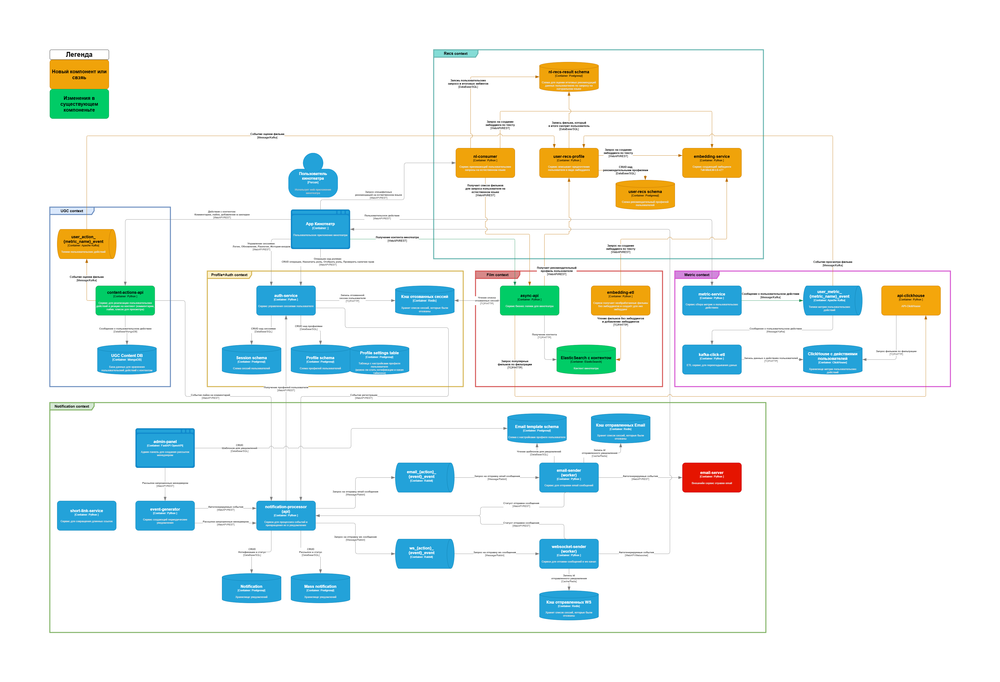

# Описание дипломного проекта «Рекомендательная система»

- [Описание дипломного проекта «Рекомендательная система»](#описание-дипломного-проекта-рекомендательная-система)
- [Запуск проекта](#запуск-проекта)
  - [Локально](#локально)
  - [Использование запущенного экземпляра](#использование-запущенного-экземпляра)
  - [Возможный сценарий проверки](#возможный-сценарий-проверки)
      - [S1. Создание рекомендаций для пользователя](#s1-создание-рекомендаций-для-пользователя)
      - [S2. Запрос рекомендации на естественном языке](#s2-запрос-рекомендации-на-естественном-языке)
      - [Инструкция по запросу рекомендации на естественном языке](#инструкция-по-запросу-рекомендации-на-естественном-языке)
  - [Требования к реализации](#требования-к-реализации)
    - [Пользовательские истории](#пользовательские-истории)
      - [Главный экран](#главный-экран)
      - [Запрос рекомендации](#запрос-рекомендации)
    - [Функциональные требования](#функциональные-требования)
  - [Критерии оценки архитектурного решения](#критерии-оценки-архитектурного-решения)
- [Архитектурный ландшафт](#архитектурный-ландшафт)
  - [Диаграмма c4](#диаграмма-c4)
  - [Сервисы дипломного проекта «Рекомендательная система»](#сервисы-дипломного-проекта-рекомендательная-система)
  - [Таблицы БД](#таблицы-бд)
    - [Таблица `nlp.processed_npl`](#таблица-nlpprocessed_npl)
    - [Таблица `recs_profile.user_recs`](#таблица-recs_profileuser_recs)
  - [Выбор модели для обработки запросов на естественном языке](#выбор-модели-для-обработки-запросов-на-естественном-языке)

# Запуск проекта
## Локально
1. Копировать файл конфигурации
```
cp -f .env.example .env
```
2. Запустить сервисы
```
make up-recs-context
```

## Использование запущенного экземпляра
Проект раскатан на виртуальной машине.
Используется прерываемая виртуальная машина.
Если адрес недоступен, необходимо попросить запустить ВМ.
- **[taaylor](https://github.com/taaylor)**
- **[Potatoes3212](https://github.com/Potatoes3212)**
- **[Kirill67tyar](https://github.com/Kirill67tyar)**

## Возможный сценарий проверки
#### S1. Создание рекомендаций для пользователя

1. **Регистрация пользователя**
   - Перейдите по [ссылке для регистрации](http://84.252.139.130/auth/openapi) и зарегистрируйте нового пользователя.

2. **Получение идентификатора фильма**
   - Используйте [сервис для получения ID фильма](http://84.252.139.130/async/openapi).

3. **Добавление фильма в закладки и выставление оценки**
   - Авторизуйтесь и добавьте фильм в закладки, а также поставьте ему оценку выше 7, используя следующие эндпоинты:
     - [Добавление фильма в закладки](http://84.252.139.130/content-api/api/v1/bookmarks/{film_id})
     - [Выставление оценки фильму](http://84.252.139.130/content-api/api/v1/films-rating/{film_id})

4. **Проверка сообщений в топиках Kafka**
   - Перейдите на [Kafka UI](http://84.252.139.130:8080/ui/clusters/kraft/all-topics?perPage=25) и проверьте сообщения в топиках.

5. **Просмотр записей в базе данных**
   - Подключитесь к базе данных по следующему адресу: `jdbc:postgresql://84.252.139.130:5432/pg_db`.
   - Проверьте таблицу `recs_profile.user_recs`. Обратите внимание, что для одного пользователя хранится максимум 3 рекомендации.

6. **Запрос рекомендательного профиля пользователя**
   - Перейдите по [ссылке для запроса профиля](http://84.252.139.130:8005/recs-profile/openapi) и получите рекомендательный профиль пользователя.

---
#### S2. Запрос рекомендации на естественном языке
Зарегать юзера: http://127.0.0.1/auth/openapi
Авторизоваться в API http://localhost/nl/openapi
Попробовать получить фильмы http://localhost/nl/openapi
Посмотреть в БД, что ответила ЛЛМ
jdbc:postgresql://localhost:5432/pg_db
креды: postgres@postgres
nlp.processed_npl

#### Инструкция по запросу рекомендации на естественном языке

1. **Регистрация пользователя**
   - Перейдите по [ссылке для регистрации](http://84.252.139.130/auth/openapi) и зарегистрируйте нового пользователя.

2. **Авторизация в API**
   - Авторизуйтесь, используя [сервис авторизации](http://84.252.139.130/nl/openapi).

3. **Получение рекомендаций**
   - Отправьте запрос на получение фильмов через [сервис рекомендаций](http://84.252.139.130/nl/openapi).

4. **Проверка ответа LLM в базе данных**
   - Подключитесь к базе данных по следующему адресу: `jdbc:postgresql://84.252.139.130:5432/pg_db`.
   - Проверьте таблицу `nlp.processed_npl`, чтобы увидеть, какой ответ был предоставлен LLM.

## Требования к реализации

### Пользовательские истории
---
#### Главный экран
1. Как неавторизованный пользователь, я хочу видеть на главном экране список популярных фильмов, чтобы определить, интересен ли мне этот онлайн‑кинотеатр.
2. Как авторизованный пользователь, я хочу видеть на главном экране популярные фильмы и персональные рекомендации на основе моей истории просмотров и оценок, чтобы быстро найти подходящий фильм.
---
#### Запрос рекомендации
1. Как авторизованный пользователь, я хочу запросить персональную рекомендацию фильмов под моё настроение, чтобы оперативно найти тот, что подойдёт.

---
### Функциональные требования
1. Система рейтинга популярности фильмов.
   - Предлагать на главном экране подборку наиболее популярных фильмов.
     - Популярность рассчитывается по количеству просмотров и оценок за последние 30 дней.
     - Интерфейс возвращает не менее 10 и не более 50 фильмов.
2. Векторное представление фильмов.
   - Генерировать эмбеддинги для каждого фильма с учётом описания, жанра и метаданных.
      - Выбрана Embedding‑модель.
      - Проведено сравнение как минимум двух моделей.
3. Рекомендации на главном экране.
   - Создавать персональные эмбеддинги описывающие предпочтения пользователя.
     - Учитывать просмотренные фильмы и поставленный рейтинг.
     - opt. Просмотренные фильмы не выдаются в рекомендациях.
   - Персонализировать выдачу фильмов для главного экрана на основе эмбеддинга предпочтений пользователя.
4. Обработка пользовательских запросов на естественном языке.
   - Принимать запрос пользователя на русском языке.
   - Запрашивать уточнение запроса при недостаточном содержании. Оптимальный запрос содержит: жанр и/или тематика и/или рейтинг.
   - Предлагать пример оптимального запроса: «Например: “комедия про космос с высоким рейтингом”».
   - Векторизировать запрос содержащий необходимую для поиска.
5. Векторный поиск по запросу.
   - Принимать вектор запроса.
   - Искать похожие фильмы в БД.
   - Возвращать список релевантных фильмов (не менее 1, не более 20).
6. Хранение истории запросов.
   - Сохранять информацию о пользовательской сессии:
      - Текст запроса и его вектор
      - opt. Выбранный фильм или факт отказа (если сессия завершена).

## Критерии оценки архитектурного решения
1. Запрос персональной рекомендации на естественном языке:
   1. Скорость обработки запроса.
   2. Точность оценки достаточности пользовательского запроса.
   3. Возможность принимать запросы на русском и английском языке. Выдавая релевантную оценку.
   4. Создание уточняющий вопросов в свободной форте (не захардкоженный текст).
2. Создание embedding для фильма в БД:
   1. Использование единой модели создания эмбеддингов.
   2. Пакетная обработка фильмов.
   3. Повторная обработка фильмов при обновлении метаданных.

# Архитектурный ландшафт
## Диаграмма c4
К дипломному спринту относится **Recs context**


## Сервисы дипломного проекта «Рекомендательная система»

- **embedding-service** - принимает на вход массив текстовых объектов, вычисляет для каждого 384‑мерный вектор признаков (embedding) с помощью модели `paraphrase-multilingual-MiniLM-L12-v2` и возвращает его в виде строки, закодированной в Base64.
- **embedding-etl** — периодическая ETL‑задача, которая загружает из Elasticsearch фильмы, добавляет к ним 384‑мерные embedding‑векторы из `embedding-service` и сохраняет обратно, чтобы обогащать данные для поиска и аналитики. Каждые 5 минут запускает задачу: по метке `last_run` в кэше выбирает из Elasticsearch фильмы без поля `embedding` или с `updated_at` > `last_run` (≤ `run_start`), запрашивает у `embedding-service` их Base64‑закодированные 384‑мерные векторы, декодирует их и сохраняет обратно в документы, обновляя `updated_at` до `run_start`.
- **nl-consumer** — сервис для «умного» поиска фильмов: принимает и валидирует запрос пользователя на естественном языке, передаёт текст в NLP/LLM‑сервис для анализа и генерирует embedding в `embedding-service`, сохраняет в БД исходный запрос, статус и результат обработки, а затем возвращает пользователю список рекомендованных фильмов.
- **recs-profile** — читает события пользовательских действий, формирует и обновляет пользовательский профиль в виде набора векторов фильмов для последующих этапов рекомендаций и персонализации.
- **user-recs schema** — таблица для быстрого доступа к пользовательским embedding-профилям для построения персональных рекомендаций.
- **nl-recs-result schema** — таблица для хранения истории пользовательских запросов на естественном языке и результаты их обработки. Лог запросов пользователей и хранения результата NLP-обработки, включая векторные представления и ответ модели для дальнейшего анализа и отладки.

## Таблицы БД

### Таблица `nlp.processed_npl`

Таблица предназначена для хранения обработанных запросов пользователей на естественном языке.

| Поле                | Тип данных      | Описание                                                                           |
| ------------------- | --------------- | ---------------------------------------------------------------------------------- |
| `id`                | `uuid`          | Уникальный идентификатор запроса                                                   |
| `user_id`           | `uuid`          | ID пользователя, который произвёл запрос                                           |
| `query`             | `varchar(1000)` | Текст пользовательского запроса рекомендации                                       |
| `processing_result` | `varchar(100)`  | Результат обработки запроса (например, статус или тип результата).                 |
| `llm_resp`          | `jsonb`         | Ответ от LLM (Large Language Model) в формате JSON.                                |
| `final_embedding`   | `_float8`       | Итоговый эмбеддинг, полученный в результате обработки запроса (может быть `NULL`). |
| `created_at`        | `timestamp`     | Дата и время создания записи. По умолчанию устанавливается `now()`.                |
| `updated_at`        | `timestamp`     | Дата и время последнего обновления записи. По умолчанию устанавливается `now()`.   |

---
### Таблица `recs_profile.user_recs`

Таблица предназначена для хранения пользовательских рекомендаций.

| Поле              | Тип данных     | Описание                                                                        |
| ----------------- | -------------- | ------------------------------------------------------------------------------- |
| `id`              | `uuid`         | Уникальный идентификатор рекомендации                                           |
| `user_id`         | `uuid`         | ID пользователя, для которого сохранена рекомендация пользователя               |
| `film_id`         | `uuid`         | Идентификатор фильма, по которому была сохранена рекомендация фильма            |
| `rec_source_type` | `varchar(100)` | Событие, вызвавшее создание рекомендации                                        |
| `embedding`       | `_float8`      | Эмбеддинг, полученный в результате обработки запроса                            |
| `created_at`      | `timestamp`    | Дата и время создания записи. По умолчанию устанавливается `now()`              |
| `updated_at`      | `timestamp`    | Дата и время последнего обновления записи. По умолчанию устанавливается `now()` |

## Выбор модели для обработки запросов на естественном языке
Были рассмотрены несколько вариантов реализации, прототипы сохранены в директории: `docs/nl-consumer/implementation_variants`
Результаты: 
1. **spacy** - Корректно обрабатывала только точные совпадения слов с примером запроса.
2. **paraphrase-multilingual-MiniLM-L12-v2** - Справлялась с поставленной задачей при наличии эмбеддинга "идеального запроса" как примера для сравнения. Но не может "додумать" контекст и задать уточняющий запрос в свободной форме.
3. **llama3** - Отлично справляется с оценкой пользовательского запроса. "Додумывает" контекст для оценки достаточности. Задаёт уточняющий вопрос на естественном языке. Имеет возможность отдавать строго типизированный ответ `format`.
