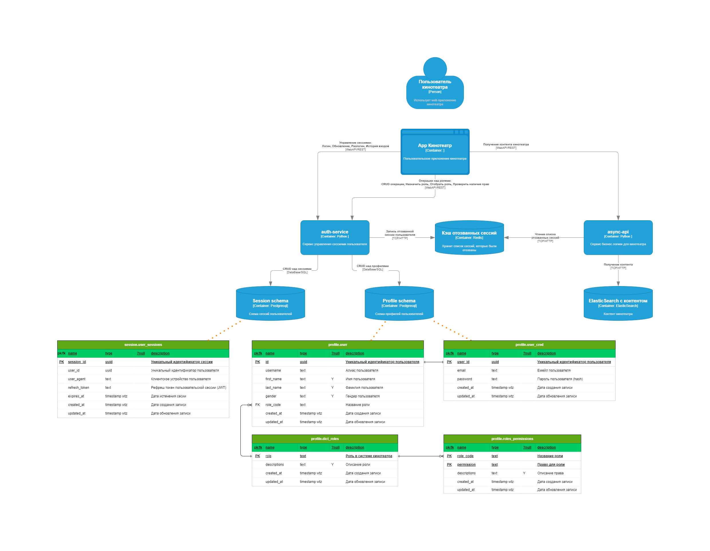

# 🎥 KINOSERVICE

**Киносервис** — это платформа для управления пользователями, ролями и получения контента онлайн-кинотеатра. Проект построен на микросервисной архитектуре с использованием современных технологий.

---
- [🎥 KINOSERVICE](#-kinoservice)
  - [🚀 Запуск проекта](#-запуск-проекта)
  - [👤 Создание суперпользователя](#-создание-суперпользователя)
  - [🛠 Сервисы проекта](#-сервисы-проекта)
    - [🔐 Auth Service](#-auth-service)
    - [🎬 Async Service](#-async-service)
    - [🎛 Admin Service](#-admin-service)
    - [🛎️ Metric Service](#️-metric-service)
      - [Требования к реализации Metrics Service](#требования-к-реализации-metrics-service)
      - [Аналитическое сравнение производительности ClickHouse и Vertica для сервиса метрик](#аналитическое-сравнение-производительности-clickhouse-и-vertica-для-сервиса-метрик)
    - [📈 Jaeger](#-jaeger)
    - [📊 Kibana-product](#-kibana-product)
    - [🛠️ Kibana-logs](#️-kibana-logs)
      - [Настройка отображения логов после запуска проекта:](#настройка-отображения-логов-после-запуска-проекта)
    - [🚨 GlitchTip](#-glitchtip)
    - [🎈 UGC-контент для платформы фильмов](#-ugc-контент-для-платформы-фильмов)
  - [Описание API](#описание-api)
  - [📂 Структура проекта](#-структура-проекта)
  - [🛠 Используемые технологии](#-используемые-технологии)
  - [👥 Ролевая модель](#-ролевая-модель)
    - [Роли и их разрешения:](#роли-и-их-разрешения)
      - [🔑 ADMIN (Администратор)](#-admin-администратор)
      - [💳 SUB\_USER (Пользователь с подпиской)](#-sub_user-пользователь-с-подпиской)
      - [👤 UNSUB\_USER (Пользователь без подписки)](#-unsub_user-пользователь-без-подписки)
      - [🕶 ANONYMOUS (Анонимный пользователь)](#-anonymous-анонимный-пользователь)
    - [Иерархия доступа к фильмам:](#иерархия-доступа-к-фильмам)
  - [🗺️ Архитектурный ландшафт](#️-архитектурный-ландшафт)
    - [Комментарии к архитектурным решениям:](#комментарии-к-архитектурным-решениям)
    - [Партиционирование PG](#партиционирование-pg)
    - [Преимущества хэш-партиционирования:](#преимущества-хэш-партиционирования)
    - [Результаты тестирования](#результаты-тестирования)
    - [Вывод](#вывод)
  - [Основной сценарий авторизации пользователя](#основной-сценарий-авторизации-пользователя)
  - [🌟 Интеграция авторизации через Yandex](#-интеграция-авторизации-через-yandex)
      - [Регистрация приложения:](#регистрация-приложения)
      - [🔄 Процесс авторизации](#-процесс-авторизации)
  - [📖 Полезные команды](#-полезные-команды)
    - [Использование Makefile](#использование-makefile)
      - [Список доступных команд](#список-доступных-команд)
    - [Запуск тестов](#запуск-тестов)
    - [Остановка и удаление контейнеров](#остановка-и-удаление-контейнеров)
  - [👥 Авторы](#-авторы)


---

## 🚀 Запуск проекта
1. Создайте `.env`, скопировав содержимое `.env.example` в `.env`.
2. В корневой директории проекта выполните команду:
   ```bash
   docker compose up -d --build
   ```

---

## 👤 Создание суперпользователя

Для создания суперпользователя выполните следующие шаги:

1. Запустите Docker Compose:
   ```bash
   docker compose up --build -d
   ```

2. Создайте суперпользователя через терминал:
   ```bash
   bash scripts/create_superuser.sh
   ```
   или
   ```bash
   docker compose exec auth-api python manage.py createsuperuser
   ```
   или
   ```bash
   docker compose exec admin-panel python manage.py createsuperuser
   ```

---

## 🛠 Сервисы проекта

### 🔐 Auth Service
Сервис управления пользователями и пользовательскими сессиями.

[Описание API](http://localhost/auth/openapi)

### 🎬 Async Service
Сервис для получения контента кинотеатра.

[Описание API](http://localhost/async/openapi)

### 🎛 Admin Service
Сервис админ-панели проекта.

[Вход в админ панель](http://localhost/admin/)

### 🛎️ Metric Service
Сервис метрик предоставляет возможность отправки пользовательских событий в колоночную БД (ClickHouse) через брокер Kafka для дальнейшей аналитики.

[Описание API](http://localhost/metrics/openapi)

#### Требования к реализации Metrics Service

Перед реализацией сервиса необходимо выявить функциональные и нефункциональные требования к сервису, также рассмотреть сценарий взаимодействия клиента и сервиса.

**Функциональные требования:**
1. Сервис должен позволять принимать события клиента как от авторизованных пользователей, так и от анонимных пользователей.
2. Доступ к метрикам должен предоставляться строго администраторам или аналитикам системы.
3. Сервис должен позволять обрабатывать данные в реальном времени.
4. Сервис должен проводить валидацию принимаемых данных, включая:
    - Проверку наличия обязательных полей: event_type, timestamp(пользователя).
    - Проверку корректности формата timestamp (ISO 8601).
    - Проверку допустимых значений event_type (лайк, комментарий, просмотр фильма и др.).
5. Каждое событие должно содержать обязательные поля event_type(лайк, коммент, просмотр фильма), timestamp(пользователя), если пользователь авторизован - поле с jwt.
6. Сервис должен быть документирован в формате OpenAPI.
7. Сервис должен сохранять события в колоночную бд, для дальнейшей аналитики.
8. В брокере сообщений необходимо предусмотреть разделение данных(топиков) по конкретным событиям на основе event_type (лайки, просмотры, комментарии и тд.)

**Нефункциональные требования:**
1. API для сбора метрик должна предусмотреть использование CORS для предотвращения подделки запросов.
2. API для сбора метрик должна позволять ограничивать количество запросов Rate limiting (1000 запросов/мин с одного IP или устройства), для избегания спама.
3. API принимает события только в формате JSON.
4. Обработка одного события не превышает 100мс, без учёта сетевых взаимодействий.
5. Валидация запроса не должна превышать 15 мс.
6. API должен поддерживать асинхроное взаимодействие, для обеспечения быстрого отклика системы.
7. API должен взаимодействовать с брокером сообщений по стилю One-Way и использовать гарантию доставки At Most Once (для обеспечения быстрого взаимодействия между компонентами).
8. Подразумевается что активных пользователей в день 1.000.000 (DAU), каждый пользователь посещает сайт ~3 раза в сутки, совершая ~25 действий, отсюда следует, что средний RPS системы будет равен: (1.000.000 * 3 * 25) / 24 часа = 75.000.000 / 86.400 = 868 RPS. Для расчета пиковой нагрузки используем правило 80/20, согласно которому 80% трафика приходится на 20% времени. То есть, пиковая нагрузка будет в 5 раз выше средней: 868 * 5 = 4340 RPS

**Сценарий взаимодействия клиента и сервиса метрики:**
1. Пользователь на стороне клиента совершает какое-либо событие (лайк, комментарий).
2. Клиент фиксирует событие пользователя.
3. Клиент выполняет POST запрос в сервис.
4. Сервис валидирует входящее событие, направляет в очередь (брокер сообщений)
5. Сервис отдает статус 200 при успешном запросе, без тела ответа ИЛИ статус 400 с описанием ошибки

#### Аналитическое сравнение производительности ClickHouse и Vertica для сервиса метрик
Аналитическое сравнение приводится в следующем [README](/docs/comparison_column_db/README.md)

### 📈 Jaeger
В проекте присутствует Jaeger для трассировки запросов.
Его UI доступен по [ссылке](http://localhost:16686/search).

### 📊 Kibana-product
Для визуализации данных из Elasticsearch используется Kibana.
Ее интерфейс доступен по [ссылке](http://localhost:5601).

### 🛠️ Kibana-logs
Для визуализации логов из Elasticsearch-logs используется Kibana.
Ее интерфейс доступен по [ссылке](http://localhost:5602).

#### Настройка отображения логов после запуска проекта:
1. Перейти в раздел "Manage spaces" кликнув на иконку пространства.
2. Перейти в раздел "Data Views" в левом боковом меню.
3. Нажать "Create data view".
4. Создать новый "data view" с "Index pattern" = "docker-logs*".
5. Перейти в раздел "Discover" кликнув на соответствующий раздел в боковом меню.
6. Делать запросы, настраивать фильтры, наслаждаться.

### 🚨 GlitchTip
1. Необходимо запустить сервисы командой make content-service-up там поднимутся auth-api и content-api.
2. Далее необходимо перейти на localhost:8005 откроется веб интерфейс GlitchTip
3. После перехода выполни все действия как в [видео](https://github.com/user-attachments/assets/066a7189-8583-4046-bf11-dd0911c4664b)
4. После того как добавишь dns в `.env` обязательно замени `localhost:8005` на `glitchtip-web:8000` (в .env.example указан пример в комментариях)
5. В `.env` Укажи `IS_GLITCHTIP_ENABLED=True`
6. Далее необходимо перезапустить контейнер content-api `docker compose up -d --build content-actions-api`
7. Для теста создал эндпоинт который вызывает исключение при делении на 0 [/private/glitchtip-test](http://localhost/content-api/openapi). Дерните его, сервис отдаст 500, а в логах можно будет увидеть что сообщение отправлено, гляньте в веб [интерфейс GlitchTip](http://localhost:8005/) там появится новое сообщение с исключением.

### 🎈 UGC-контент для платформы фильмов

На нашей платформе пользователи могут активно взаимодействовать с контентом, создавая уникальный пользовательский опыт (UGC). Основные возможности:

- Рецензии на фильмы: Пишите развернутые отзывы о просмотренных фильмах, делитесь впечатлениями и обсуждайте их с сообществом.
- Оценки фильмов: Ставьте рейтинги фильмам, чтобы влиять на их популярность и помогать другим пользователям в выборе.
- Закладки: Сохраняйте понравившиеся фильмы в личный список, чтобы легко вернуться к ним позже.
Эти функции делают платформу живой и интерактивной, позволяя каждому пользователю стать частью кинематографического сообщества!

[Описание API](http://localhost/content-api/openapi)
---

## 📂 Структура проекта

```
yandex_kinoservice/
├── backup/                          # Скрипты и данные для резервного копирования
│   ├── clickhouse_init_struct/      # Инициализация структуры ClickHouse БД
│   ├── elastic_dump/                # Дамп данных для Elasticsearch
│   │   ├── dump/                    # Сырые дампы данных Elasticsearch (фильмы, жанры, персоны)
│   │   ├── dump_extractor/          # Скрипты для извлечения данных из Elasticsearch
│   │   └── dump_loader/             # Скрипты для загрузки данных в Elasticsearch
│   └── postgres_dump-auth/          # Дамп данных для PostgreSQL (пользователи, роли, права)
│       └── dumps/                   # CSV-файлы с данными для импорта в PostgreSQL
├── docs/                            # Документация проекта
│   ├── comparison_column_db/        # Аналитическое сравнение ClickHouse и Vertica
│   │   └── conf_clickhouse/         # Конфигурационные файлы ClickHouse для тестирования
│   ├── kafka_usage_examples/        # Примеры использования Kafka в проекте
│   ├── test_tools/                  # Инструменты для тестирования (создание пользователей и т.д.)
│   └── use_cases/                   # Сценарии использования и UML диаграммы
├── infra/                           # Инфраструктурные компоненты
│   ├── clickhouse/                  # Конфигурация колоночной БД ClickHouse
│   ├── elk/                         # ELK стек для логирования и мониторинга
│   │   └── config/                  # Конфигурации Filebeat и Logstash
│   ├── kafka/                       # Брокер сообщений Apache Kafka
│   ├── mongodb/                     # Документоориентированная БД MongoDB
│   └── nginx/                       # Веб-сервер и обратный прокси
│       └── configs/                 # Конфигурационные файлы Nginx
├── libs/                            # Общие библиотеки для переиспользования
│   ├── auth_utils/                  # Библиотека для авторизации и аутентификации
│   │   ├── auth_utils/              # Исходный код библиотеки авторизации
│   │   └── dist/                    # Скомпилированные файлы библиотеки
│   ├── rate_limite_utils/           # Библиотека для ограничения частоты запросов (Rate Limiting)
│   │   └── rate_limite_utils/       # Исходный код библиотеки rate limiting
│   └── tracer_utils/                # Библиотека для трассировки запросов (Jaeger)
│       ├── dist/                    # Скомпилированные файлы библиотеки трассировки
│       └── tracer_utils/            # Исходный код библиотеки трассировки
└── services/                        # Микросервисы приложения
    ├── admin-panel/                 # Административная панель Django
    │   └── src/                     # Исходный код админ-панели
    ├── async-api/                   # Асинхронный API для получения контента (FastAPI)
    │   ├── src/                     # Исходный код async-api сервиса
    │   └── tests/                   # Функциональные и интеграционные тесты
    ├── auth-service/                # Сервис авторизации и управления пользователями (FastAPI)
    │   ├── src/                     # Исходный код auth-service
    │   └── tests/                   # Тесты для сервиса авторизации
    ├── content-actions-service/     # Сервис действий с контентом (лайки, закладки, рецензии)
    │   └── src/                     # Исходный код content-actions-service
    └── metric-service/              # Сервис метрик и аналитики пользовательских событий
        ├── etl/                     # ETL процессы для обработки метрик из Kafka в ClickHouse
        ├── metric-api/              # API для сбора пользовательских событий (FastAPI)
        └── tests/                   # Тесты для сервиса метрик
```

---

## 🛠 Используемые технологии

- **FastAPI** — быстрый и асинхронный веб-фреймворк.
- **Django** — фреймворк для быстрой разработки веб-приложений.
- **Flask** - простой веб-фреймворк.
- **PostgreSQL** — реляционная база данных.
- **MongoDB** - документоориентированная БД для хранения данных о пользовательских действиях.
- **ClickHouse** - колоночная БД для хранения метрик о действиях пользователя на клиенте.
- **Redis** — кэширование и управление сессиями.
- **Elasticsearch** — поисковый движок для хранения и поиска фильмов и логирования.
- **Logstash** - агрегатор и маршрутизатор логов.
- **Filebeat** - сборщик логов для docker контейнеров.
- **Docker & Docker Compose** — контейнеризация и управление сервисами.
- **Pydantic** — валидация данных.
- **async_fastapi_jwt_auth** — работа с JWT-токенами для аутентификации и авторизации пользователя.
- **Nginx** — веб-сервер и прокси-сервер.
- **Pytest** — фреймворк для тестирования.
- **SOLID** — архитектурные принципы в логике приложения.
- **Kafka** — распределенная платформа потоковой обработки данных для асинхронного обмена сообщениями между сервисами.
- **CI/CD** — непрерывная интеграция и доставка с использованием инструментов GitHub Actions для автоматизации тестирования, сборки и развертывания.
---

## 👥 Ролевая модель

В системе реализована следующая ролевая модель:

### Роли и их разрешения:

#### 🔑 ADMIN (Администратор)
- CRUD_ROLE - Управление ролями (создание, чтение, обновление, удаление)
- ASSIGN_ROLE - Назначение ролей пользователям
- FREE_FILMS - Доступ к бесплатным фильмам
- PAID_FILMS - Доступ к платным фильмам
- CRUD_FILMS - Полный доступ к управлению фильмами

#### 💳 SUB_USER (Пользователь с подпиской)
- PAID_FILMS - Доступ к платным фильмам
- FREE_FILMS - Доступ к бесплатным фильмам

#### 👤 UNSUB_USER (Пользователь без подписки)
- FREE_FILMS - Доступ только к бесплатным фильмам

#### 🕶 ANONYMOUS (Анонимный пользователь)
- FREE_FILMS - Доступ только к бесплатным фильмам

### Иерархия доступа к фильмам:
1. CRUD_FILMS - полный административный доступ к контенту
2. PAID_FILMS - доступ к премиум контенту (требуется подписка)
3. FREE_FILMS - базовый уровень доступа, доступен всем пользователям

---

## 🗺️ Архитектурный ландшафт



### Комментарии к архитектурным решениям:
* Для проверки отзыва токенов пользователя используется локальная библиотека **auth_utils**:
  * Библиотека реализует проверку с помощью запроса в Redis. Данное решение принято осознанно, так как использование HTTP-запросов к сервису авторизации на каждый запрос к сервису бизнес-логики мы посчитали неоптимальным с точки зрения производительности.
    * Риски интеграции сервисов через БД приняты на данном этапе проекта.
    * В ходе развития проекта планируется добавить событийную схему передачи факта отзыва сессии пользователя и избавиться от интеграции через БД.
* Проверка прав пользователя реализована с помощью записи текущих прав непосредственно в JWT-токен:
  * Полезная нагрузка токена:
```json
{
  "sub": "bf48004a-549c-4c83-ac84-f69ad1229d63",
  "iat": 1746186562,
  "nbf": 1746186562,
  "jti": "7dd19a81-cc2a-40e5-9dd7-8c6e3322297d",
  "exp": 1746187762,
  "type": "access",
  "fresh": false,
  "user_id": "8b541aeb-9f82-4b2c-ac6f-fde3707262a7",
  "session_id": "bf48004a-549c-4c83-ac84-f69ad1229d63",
  "username": "dimaa",
  "user_agent": "Mozilla/5.0 (Windows NT 10.0; Win64; x64) AppleWebKit/537.36 (KHTML, like Gecko) Chrome/135.0.0.0 Safari/537.36",
  "role_code": "ADMIN",
  "permissions": [
    "ASSIGN_ROLE",
    "CRUD_FILMS",
    "CRUD_ROLE",
    "FREE_FILMS",
    "PAID_FILMS"
  ]
}
```
* При создании токена используется асимметричный алгоритм **RS256**:
  * Приватный ключ известен только **auth-api**, который выпускает токены.
  * Библиотека **auth_utils** использует только публичный ключ для верификации подписи.
* Модель фильма была доработана. Фильмы разделены на 3 группы:
  * FREE - доступны всем пользователям, включая неавторизованных
  * PAID - доступны пользователям, обладающим правами CRUD_FILMS / PAID_FILMS
  * ARCHIVED - доступны пользователям с правами CRUD_FILMS

### Партиционирование PG

В проекте используется **хэш-партиционирование** для таблицы `user_sessions_hist`. Этот метод позволяет равномерно распределять данные между партициями на основе хэш-функции, применяемой к значению ключа партиционирования. В данном случае ключом партиционирования является поле `user_id`.

### Преимущества хэш-партиционирования:
- **Равномерное распределение данных**: Хэш-функция обеспечивает равномерное распределение записей между партициями, что минимизирует дисбаланс.
- **Ускорение запросов**: Запросы, использующие ключ партиционирования, выполняются быстрее, так как они обращаются только к одной партиции. В рамках нашего бизнесс процесса получение истории сессий выполняется для одного пользователя по user_id
- **Масштабируемость**: Легко добавлять новые партиции при увеличении объема данных.

### Результаты тестирования

В ходе тестирования было проверено распределение данных между партициями. Результаты показали равномерное распределение записей:

| Партиция                         | Количество записей |
| -------------------------------- | ------------------ |
| **`user_sessions_hist (total)`** | **35491**          |
| `user_sessions_hist_p0`          | 8935               |
| `user_sessions_hist_p1`          | 8808               |
| `user_sessions_hist_p2`          | 8851               |
| `user_sessions_hist_p3`          | 8897               |


**Тестовый запрос на получение данных**
```sql
explain analyze select * from session.user_sessions_hist where user_id='5e3047c4-9910-4fbe-b414-bac5ced680ca'
```

| QUERY PLAN                                                                                                                                                                  |
| --------------------------------------------------------------------------------------------------------------------------------------------------------------------------- |
| Index Scan using idx_user_sessions_hist_p2_user_id on user_sessions_hist_p2 user_sessions_hist  (cost=0.29..8.30 rows=1 width=84) (actual time=0.020..0.021 rows=1 loops=1) |
| Index Cond: (user_id ='5e3047c4-9910-4fbe-b414-bac5ced680ca'::uuid)                                                                                                         |
| Planning Time: 0.061 ms                                                                                                                                                     |
| Execution Time: 0.041 ms                                                                                                                                                    |


### Вывод

Результаты тестирования подтверждают, что выбранная методика хэш-партиционирования обеспечивает равномерное распределение данных между партициями. Это позволяет эффективно использовать ресурсы базы данных и ускоряет выполнение запросов.

---

## Основной сценарий авторизации пользователя


---

## 🌟 Интеграция авторизации через Yandex

Реализация OAuth2-авторизации через Yandex позволяет пользователям аутентифицироваться в сервисе с использованием учетных данных Yandex.
Система поддерживает:

- Привязку аккаунта Yandex к существующему профилю.
- Отвязку сервиса в любое время.
- Авторизация и регистрация через сервис Yandex.

#### Регистрация приложения:

- Создайте приложение в Yandex ID для получения: **Client ID**, **Client Secret**
- Настройте Redirect URI `https://ваш-домен/auth/social/callback`
- Укажите полученные ключи в конфигурации сервиса `.env`.

#### 🔄 Процесс авторизации
Получите параметры OAuth:

1. Вызовите `GET /auth/social`, найдите в ответе `auth_url` для Yandex.
2. Перейдите по `auth_url` → пользователь подтверждает доступ → Yandex перенаправляет на `redirect_uri` с `code` и `state` в URL.

3. Завершите авторизацию:
Отправьте `POST /login/yandex` с полученными `code` и `state`.

4. Получите токен:
В ответе будет `access_token` для доступа к API

## 📖 Полезные команды

### Использование Makefile
Makefile — это инструмент автоматизации, который позволяет упрощать выполнение часто используемых команд. В данном проекте Makefile используется для управления контейнерами и тестами.

Пример вызова команды с параметром:
```bash
make up srv=auth-api
```

#### Список доступных команд
- Запускает все контейнеры в фоновом режиме с пересборкой образов. Можно указать `srv` для запуска конкретного сервиса.
  ```bash
  make up
  ```
- Останавливает все контейнеры. Можно указать `srv` для остановки конкретного сервиса.
  ```bash
  make down
  ```
- Останавливает все контейнеры и удаляет связанные тома. Можно указать `srv` для удаления томов конкретного сервиса.
  ```bash
  make down-v
  ```
- Запускает контейнеры и сразу выводит логи. Можно указать `srv` для просмотра логов конкретного сервиса.
  ```bash
  make up-logs
  ```
- Выводит логи всех сервисов или указанного через `srv`.
  ```bash
  make logs
  ```
- Запускает тесты для сервиса async-api.
  ```bash
  make test-async-api
  ```
- Запускает тесты для сервиса auth-api.
  ```bash
  make test-auth-api
  ```
---

### Запуск тестов

**Запуск тестов async-api:**
```bash
docker-compose -f docker-compose-tests.yml --profile async-api-test up --build -d && docker-compose -f docker-compose-tests.yml  logs -f tests-async-api && docker-compose -f docker-compose-tests.yml --profile async-api-test  down -v
```
**Запуск тестов auth-api**
```bash
docker-compose -f docker-compose-tests.yml --profile auth-api-test up --build -d && docker-compose -f docker-compose-tests.yml logs -f tests-auth-api && docker-compose -f docker-compose-tests.yml --profile auth-api-test  down -v
```
---
### Остановка и удаление контейнеров
```bash
docker compose down -v
```

---

## 👥 Авторы

- **[taaylor](https://github.com/taaylor)**
- **[Potatoes3212](https://github.com/Potatoes3212)**
- **[Kirill67tyar](https://github.com/Kirill67tyar)**
